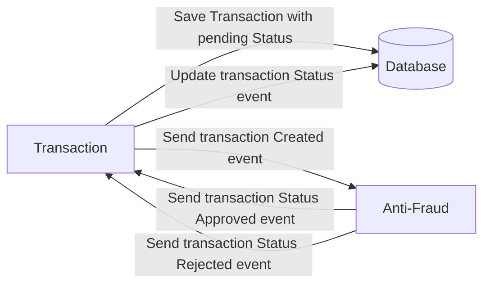

# Yape Code Challenge :rocket:

Our code challenge will let you marvel us with your Jedi coding skills :smile:. 

Don't forget that the proper way to submit your work is to fork the repo and create a PR :wink: ... have fun !!

- [Problem](#problem)
- [Tech Stack](#tech_stack)
- [Send us your challenge](#send_us_your_challenge)
- [Challenge Resolve by Master Jedi "Darth" Pedro](#Challenge_Resolve_by_Master_Jedi_"Darth"_Pedro)

# Problem

Every time a financial transaction is created it must be validated by our anti-fraud microservice and then the same service sends a message back to update the transaction status.
For now, we have only three transaction statuses:

<ol>
  <li>pending</li>
  <li>approved</li>
  <li>rejected</li>  
</ol>

Every transaction with a value greater than 1000 should be rejected.



# Tech Stack

<ol>
  <li>Node. You can use any framework you want (i.e. Nestjs with an ORM like TypeOrm or Prisma) </li>
  <li>Any database</li>
  <li>Kafka</li>    
</ol>

We do provide a `Dockerfile` to help you get started with a dev environment.

You must have two resources:

1. Resource to create a transaction that must containt:

```json
{
  "accountExternalIdDebit": "Guid",
  "accountExternalIdCredit": "Guid",
  "tranferTypeId": 1,
  "value": 120
}
```

2. Resource to retrieve a transaction

```json
{
  "transactionExternalId": "Guid",
  "transactionType": {
    "name": ""
  },
  "transactionStatus": {
    "name": ""
  },
  "value": 120,
  "createdAt": "Date"
}
```

## Optional

You can use any approach to store transaction data but you should consider that we may deal with high volume scenarios where we have a huge amount of writes and reads for the same data at the same time. How would you tackle this requirement?

You can use Graphql;

# Send us your challenge

When you finish your challenge, after forking a repository, you **must** open a pull request to our repository. There are no limitations to the implementation, you can follow the programming paradigm, modularization, and style that you feel is the most appropriate solution.

If you have any questions, please let us know.

# Challenge Resolve by Master Jedi "Darth" Pedro

To can run the demo follow below steps: 
<ol>
<li>
if you have already docker install and running in docker swarm mode, execute below command.

```
docker stack deploy -c docker-compose.yml yape
```
</li>
<li>
To validate if all services are working run this command. All services  to be in 1/1.

```
docker service ls 
```
</li>
<li>
Once docker is set up, install project dependencies.

```
npm install
```
</li>
<li>
For easy Postgres management you can connect to pgAdmin at:

```
http://172.17.0.1:4020/
```
</li>
<li>
Create below records on the database to can continue with the demo.

```sql
insert into credit values ('cac17a36-ece7-478f-89d1-3e1eeef2b18a', 'My Name') ;

insert into debit values ('dac17a36-ece7-478f-89d1-3e1eeef2b18a', 'My Name') ;
```
</li>
<li>
To run the project execute below command

```
npm run start:dev
```
</li>
<li>
To create a payment you can use below endpoint and body.

```
POST http://localhost:3001/api/v1/payments/
```

```json
{
    "accountExternalIdCredit": "cac17a36-ece7-478f-89d1-3e1eeef2b18a",
    "accountExternalIdDebit": "dac17a36-ece7-478f-89d1-3e1eeef2b18a",
    "tranferTypeId": 1,
    "value": 100
}
```
</li>
<li>
To can query new record created you can use below endpoint:

```
GET http://localhost:3001/api/v1/payments/{Payment-id-created}
```

</li>
</ol>

## Extra Information

You can use below endpoints to can send testing messages to Kafka.
<ol>
  <li>Post: GET http://localhost:3001/kafka/send-message </li>
  <li>Start Consumer: GET http://localhost:3001/kafka/send-message </li> 
  <li>You have to wait a couple of second before start looking messages consumed. </li>
</ol>

## Disclaimers

Things not included in the project:
- In app.module.ts I've a configuration in place about how to configure master and slave for read and write segregations, this will help to reduce and optimize operations into database. Also, another solution could be using a Memory Cache like Redis to keep data in other layer reduction consumption of database.
- There is no any test cases written.